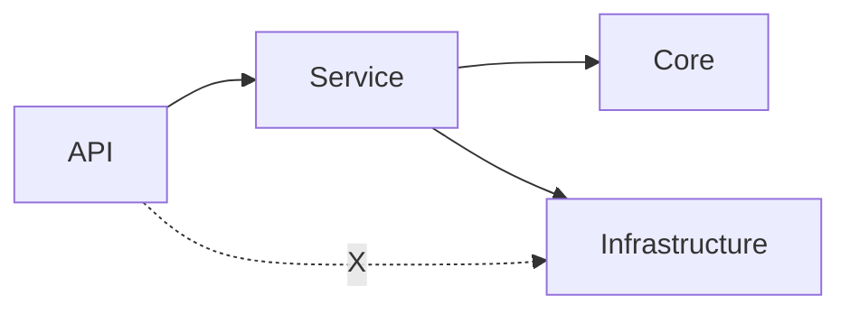

# dotnet-ai-blueprint — Starter Pack 導入手冊（Phase A–D）

> 本檔位於 **repository 根目錄**。中路徑若無特別說明，皆相對於 repo root。若要匯出精簡 seed 給其他 repo，請在 **本 repo root** 執行 `_starter-pack-seed/build-seed.ps1`（預設輸出於 `_starter-pack-seed/out/`，見 §3.1）。部署前請先閱：[docs/starter-pack/README.md](docs/starter-pack/README.md)。

## IDE：Cursor、Copilot

- **Cursor**：優先讀取 [`.cursor/rules/`](.cursor/rules/)；這是 repo 唯一受支援的 Cursor 規則入口。
- **GitHub Copilot（Visual Studio / VS Code）**：以 [`.github/copilot-instructions.md`](.github/copilot-instructions.md) 為專案指引（內含 **Plan-first**：先在 Chat 選 **Plan** / `/plan`，核准後再 **Agent** 或手改）；聊天可搭配 [`COPILOT_PROMPT.md`](COPILOT_PROMPT.md)（短索引貼上）。

> 入口檔負責讀序與索引；工程規則仍以 `docs/ARCHITECTURE.md`、`docs/rules/*`、`templates/`、`skeleton/` 為準。

### Cursor 規則分層

- **常駐規則**：`00-entrypoint.mdc`、`pattern-match.mdc`、`rule-guard.mdc`、`shadow-ref.mdc`、`context-discovery.mdc`、`skeleton-sync.mdc`
- **手動 SOP**：`refactor-uow.mdc`、`add-resilience.mdc`、`api-standard.mdc`
- **建議進入方式**：先讀 [`.cursor/rules/README.md`](.cursor/rules/README.md)，再進入 [`00-entrypoint.mdc`](.cursor/rules/00-entrypoint.mdc)；若 `rule-guard.mdc` 發現違規，再載入對應手動 SOP 修正

## 簡介

本 repository 提供一套**可複製的分層 .NET 後端 Starter Pack**：文件、規範、可執行的架構測試模板（`*.cs.txt`）、AI 引導入口（Cursor/Copilot）、以及安全/效能交付模板。它**不是 runtime library**；用途是將工程約束與驗收證據落地為可移植資產。

### 摘要

- 以 Phase A–D 建立可複製的導入流程與驗收基線。
- 以可執行測試與文件模板提供可追溯之交付證據。
- 以漸進導入方式支援新專案與既有專案之落地。

### 成熟度：從手動到自動（精簡版）

- **手動階段（形成一致基線）**：以規範入口與 `templates/`、`docs/starter-pack/shadow-examples/` 固化寫法與責任邊界，降低差異。
- **CI 品質門檻（自動化攔截）**：將 layering/firewall/defensive tests 落地為測試與 pipeline 品質門檻，使違規於本機或 CI 階段被阻擋。
- **交付證據（可追溯）**：將安全/效能驗收模板納入每次交付的固定附件（流程化），再視需要將產出物接入 pipeline 要求（可稽核）。

## 大綱
- **可交付內容**：能力（功能）、規範（規則）、執行手段
- **導入路線（Phase A–D）**：各階段目的、產出物、驗收條件
- **落地步驟**：seed 匯出 → 搬入 → 初始化 → 啟用測試品質門檻 → 納入交付流程
- **風險與控管**：初始化、既有專案導入策略、常見問題排查
- **結論**：適用情境與下一步建議

## 細節

### 1) 你會得到什麼（能力 / 規範 / 手段對齊）
- **能力（功能）**
  - 架構越界可由 CI 攔截（分層/防火牆規則以測試落地）
  - 團隊具備可複製的標準寫法（patterns / samples）
  - AI 輔助可被約束（以 repo 內入口指引約束生成）
  - 安全/效能可循序導入（模板化交付清單與驗收）
- **規範（你在落地的規則）**
  - 分層責任與依賴方向（API/Service/Infrastructure）
  - 邊界與交易（Transaction/Boundary）
  - Repository/Service/API 禁忌（防火牆）
  - 安全（ASVS mapping）與效能驗收（k6/jmeter）
- **手段（怎麼達成）**
  - `docs/starter-pack/**`：說明與模板入口
  - `docs/starter-pack/architecture-tests/*.cs.txt`：可執行的架構測試模板
  - `anchors/`、`docs/starter-pack/shadow-examples/`、`templates/`：可複製樣式
  - `.github/copilot-instructions.md`：Copilot 入口
  - [`.cursor/rules/`](.cursor/rules/)：Cursor/Agent 主入口
  - `docs/starter-pack/optional/**`：安全/效能/Minimal API 可選模組

### 1.0 分層依賴方向圖（視覺化，降低溝通誤解）

> 目標：用一張圖說清楚「依賴方向」與「禁忌路徑」，避免光靠文字造成的理解落差。



- **箭頭方向**：一律由外向內（API → Service → Core/Infrastructure）。
- **禁忌路徑**：API 禁止橫跨 Service 直接觸碰 Infrastructure（圖中 `Api -.X.-> Infra`）。

### 1.0a 視覺化導覽：先看概念圖，再看 generated graph

> 目標：把「規範上的責任邊界」與「實際專案相依輸出」放在同一條 onboarding 路徑，降低新人與 AI 對分層規則的誤讀。

1. **先看上面的 Mermaid 概念圖**
   - 用來理解這個 starter pack 想要的責任方向與禁忌路徑。
2. **再產生實際 dependency graph**
   - 在 repo root 執行：

```powershell
powershell -NoProfile -ExecutionPolicy Bypass -File ".\tools\dependency-graph\generate.ps1"
```

   - 預設輸出：`artifacts/deps.dot`
   - 若有安裝 Graphviz，可再轉成 SVG：

```powershell
dot -Tsvg artifacts/deps.dot -o artifacts/deps.svg
```

3. **最後拿 generated graph 回頭比對概念圖**
   - 概念圖回答「理想上誰可以依賴誰」。
   - generated graph 回答「現在專案實際上誰依賴誰」。
   - 若兩者不一致，真正要阻擋的依然是 `docs/rules/**` 與 architecture tests，而不是圖本身。

延伸閱讀：

- `docs/optional/visualization/dependency-graph.md`
- `tools/dependency-graph/`

### 1.1 Overview（用什麼方式/套件達成什麼）— 全部 / 舊案 / 新案

> 目標：讓工程師（或 AI）不用先讀完整細節，就能知道「用哪些手段」達成「哪些約束與效果」，以及舊案/新案的預設策略差異。

#### 這整套帶來什麼改變（半量化，非保證）

- **對人（工程師 / Reviewer / PM）**
  - **預期明顯減少**「寫法不一致、責任放錯層、交易/例外邊界混亂」這類反覆 review 問題。
  - **驗收更容易**：因為多數規則可落成可執行品質門檻（測試/掃描/本地檢查），驗收可由可執行結果與產出物佐證。
  - **交付更可預期**：Phase A→B→C→D 有固定節奏；舊案可以先 L0/L1/L2（不動核心）就先看到改善。
  - **風險更可控**：既有專案可先僅約束新/變更路徑，避免一次性要求全域一致。

- **對 AI / IDE（Copilot / Cursor / Agent）**
  - **生成更可控**：入口索引（[`.cursor/rules/00-entrypoint.mdc`](.cursor/rules/00-entrypoint.mdc)、[`.github/copilot-instructions.md`](.github/copilot-instructions.md)）規定「先讀哪些規則、優先抄哪些模板」。
  - **降低偏離規範的機率**：以 templates + shadow examples 提供可複製樣式，減少在缺乏上下文時自行產生不一致結構。
  - **錯誤更早被發現**：即使產生越界程式，架構測試/防火牆可於本機或 CI 早期阻擋。

- **對結果（品質 / 速度）**
  - **預期明顯減少**：SQL injection 風險（禁插值/禁 `SELECT *`）、sync-over-async、層級越界、repo 內混商規等高頻缺陷。
  - **預期縮短**：新案起手式與 onboarding 時間（因為有清楚的讀序入口與可複製骨架）。
  - **非保證**：改善幅度取決於是否依 Phase 導入，以及品質門檻是否納入常態流程。本 pack 提供工具鏈與落地方法，結果仍需由導入品質與團隊執行確保。

#### 全部共通（無論舊案/新案都成立）

- **規範（prose rules）**：`docs/rules/**`（核心五份 + optional automation）
  - **達成**：把「責任邊界/禁忌/寫法」變成可被 AI 與人一致遵循的單一真理來源。
- **非信任資源入口（檔案上傳 / Untrusted Asset Ingress）**：`docs/rules/file-upload.md`
  - **達成**：把「不信任原檔」與「防腐層（ports/adapters）隔離解析與儲存」寫成可移植規則；同時覆蓋合規場景下必須保留原檔的 **Dual-Track / Quarantine（三層緩衝）**（Raw/Vault、Processing、Sanitized/Domain Assets）與 **`IsSanitized` 狀態閘門**。
- **交易責任（Transaction ownership）**：`docs/rules/transactions.md` + `docs/starter-pack/core/transactions.md`
  - **達成**：把「顯式短生命週期 UoW、禁止交易中遠端 IO、Query 不開交易」寫成可移植規則，並給舊案的 rollout 對策。
- **韌性規則（Resilience policy）**：`docs/rules/resilience.md`
  - **達成**：把 timeout ladder、bounded retry、circuit breaker 與 outbound preflight 檢查變成統一規範。
- **ADR 工程習慣**：`docs/adr/README.md` + `docs/adr/template.md`
  - **達成**：把「為什麼這樣做」固定下來，降低團隊換人/AI 亂引入新依賴或新慣例。
- **可複製的程式樣板（templates）**：`templates/**`
  - **達成**：提供可編譯骨架與寫法錨點，包含顯式 UoW、read-only GET gateway、idempotent POST gateway、outbox repository、idempotency repository 等樣板，避免每案各自發明。
- **架構測試模板（可執行品質門檻）**：`docs/starter-pack/architecture-tests/*.cs.txt`
  - **達成**：把分層與防火牆規則落地成「測試」，讓違規在本機/CI 被攔截。
  - **典型工具/套件**：ArchUnitNET（分層依賴）+ source-scan（regex/規則掃描，通常以 NUnit/xUnit/MSTest 跑起來）。
- **Defensive tests（高訊噪比）**：`docs/starter-pack/architecture-tests/PlaceholderGuardTests.cs.txt`、`ExceptionLeakTests.cs.txt`
  - **達成**：
    - placeholder guard：避免「模板沒替換」造成品質門檻形同虛設。
    - exception leak：避免把 DB driver/內部例外細節（含敏感訊息）回吐給 API client。
- **AI 入口 / 索引（生成約束）**
  - **Cursor**：[`.cursor/rules/`](.cursor/rules/)（唯一受支援入口）
  - **Copilot**：`.github/copilot-instructions.md`
  - **達成**：規定讀取順序、禁止捷徑、優先複製 templates/shadow-examples，降低產出偏離規範的機率。
- **驗收模板（DoD/交付）**：`docs/starter-pack/optional/**`
  - **達成**：把 ASVS/效能驗收變成可勾選的交付資產（非一次到位）。
- **非結構化資料的防禦深度（optional profiles）**：`docs/starter-pack/optional/security/*`
  - **達成**：提供可複製的 profile：
    - Excel/OOXML：G-pre0（簽章/AV/解壓炸彈/外部關聯封鎖/例外清洗/稽核）
    - Image：re-encode、剝離 EXIF、尺寸/像素上限、polyglot 風險降低、raw/sanitized 雙軌
  - **導入策略**：既有專案可先以 report-only 盤點，再逐步將高風險項目轉為阻斷式檢查門檻。
- **依賴可視化（optional）**：`docs/optional/visualization/dependency-graph.md`
  - **達成**：把分層依賴關係輸出成圖（DOT/SVG），方便在評審/資安審查時解釋「依賴方向」與「哪些層被禁止」；repo 內可搭配 `tools/dependency-graph/` 直接產生 artifact。

#### 既有專案導入（以顯式 UoW 與漸進收斂為原則）

- **策略核心**：優先避免對既有核心邏輯進行非必要改動（除非需求或風險控管需要）。
- **交易先收斂（UoW-first）**：先禁止「交易中遠端 IO」與「Query 開交易」，再逐步把寫入路徑收斂成顯式短交易。
  - **達成**：優先降低 connection pool starvation 與隱性長交易風險。
- **局部啟用（Rollout）**：新端點/新路徑先套規則與測試品質門檻；舊路徑先不強制要求全數通過
  - **達成**：避免導入初期大量違規造成 pipeline 失敗，進而阻塞交付。
- **巢狀交易注意**：若既有程式已使用 `TransactionScope/BeginTransaction/Commit`，不建議再疊加自動交易 filter；宜先盤點與清理，或確保 UoW 具備重入/等冪行為。

#### 新專案導入（可分步驟、可逐步加嚴）

- **Day0 基線**：讀序入口 + templates + 最小架構測試（Phase A/B）先上線，再逐步加 firewall（Phase C）。
- **一致性優先**：可全域啟用嚴格規則（analyzers/architecture tests）避免累積歷史包袱。

### 2) 導入路線（Phase A–D）

> 每個 Phase 都用同一套規格寫法：**目的 → 產出物 → 規範 → 達成方式 → 驗收 → 風險/對策**。
> 這樣你把它交給別的工程師，他只要照規格就能落地。

#### Phase A（Day 0）：規範與 AI 入口先上線
- **目的**：讓團隊先有一致的讀序入口與規範定位，並讓 Cursor/Copilot 的生成方向一致。
- **產出物**：
  - `docs/starter-pack/README.md`、`docs/starter-pack/core/transactions.md`
  - `.github/copilot-instructions.md`
  -（若用 Cursor Agent）[`.cursor/rules/`](.cursor/rules/)
  - `anchors/`、`docs/starter-pack/shadow-examples/`、`templates/`
- **主要規範**：分層責任、交易/邊界、基本 code quality/SQL/mapping/testing。
- **達成方式**：把上述檔案複製進目標 repo，並在團隊 onboarding / PR 指引中把它們當作固定的「Start here」讀序。
- **驗收（必過）**：
  - 新進工程師 10 分鐘內能找到：規範入口、範本入口、交易/邊界規則。
  - Copilot/AI 在 repo 內生成時能被入口索引引導（至少不偏離分層語言）。
- **風險/對策**：讀序入口散落或沒被引用 → 在 `docs/` 或 README 設清楚「Start here」並在 PR template/工程指引連結它。

**Log 稽核（Audit Log）建議**：

- 建議在 Phase A 規範中加入「Audit Log 統一攔截點」之原則與最低要求（例如於 HTTP 邊界或全域例外處理器集中紀錄，並避免與主交易耦合）。
  - 目標：使可追溯性具備一致落點，便於稽核與追查。

#### Phase B：Layering 架構測試品質門檻上線（CI 攔截越界）
- **目的**：把分層規範從「人工 review」轉換為「CI 可執行品質門檻」。
- **產出物**：測試專案內新增（由模板改成 `.cs`）的 layering tests。
- **主要規範**：
  - API 不得直接使用 Repository（應透過 Service）。
  - Infrastructure 不反向依賴 API。
  - 依你的 solution 命名空間/專案切分把規則寫死。
- **達成方式**：
  - 來源：`docs/starter-pack/architecture-tests/GenericLayeringArchitectureTests.cs.txt`
  - 作法：複製到測試專案 → 改副檔名 `.cs` → 替換 placeholders → 本機執行 → 接入 CI。
  - 技術常見形態：基於反射/依賴圖的架構測試或自訂規則（模板定義「哪些 assembly/namespace 可依賴哪些」）。
- **驗收（必過）**：
  - 在測試中刻意製造越界（例如 Controller 直接引用 Infrastructure/Repository）時，CI 會失敗。
  - PR pipeline 中 test step 會執行且會阻擋 merge。
- **風險/對策**：既有專案導入可能出現大量失敗 → 先建立可執行基線並完成盤點；可先放寬規則或先只針對新/變更路徑，逐步收斂。

**觀察模式（唯讀式掃描 / 不阻斷 CI）**：

- **目的**：在品質門檻尚未成熟前，先提供可量化的現況盤點（例如「目前有 50 處越界」），僅報告、不阻斷交付流程。
- **建議作法（兩種皆可）**：
  - **獨立 CI job（report-only）**：新增一個僅產出報告的 job，主 pipeline 仍維持原有行為。
    - 產出物：越界數量、違規清單、趨勢（每週/每月）。
  - **環境變數切換**：以環境變數（例如 `STARTER_PACK_OBSERVE=1`）使測試以「報告模式」執行。
    - 導入初期：開啟觀察模式。
    - 收斂後：關閉觀察模式，升級為阻斷式品質門檻。

#### Phase C：Firewall（API/Service/Repository）品質門檻上線
- **目的**：將常見的責任越界與高風險依賴行為具體化，補足 Phase B 對細部禁忌的覆蓋。
- **產出物**：測試專案內新增 firewall tests。
- **主要規範**（示例方向）：
  - API 層不得觸碰 Infrastructure 細節或特定命名空間。
  - Service 層不得做跨界依賴（維持 orchestration/業務規則責任）。
  - Repository 層不得承擔非必要的業務整形責任（依團隊規範定義）。
- **達成方式**：
  - 來源：
    - `docs/starter-pack/architecture-tests/GenericApiFirewallArchitectureTests.cs.txt`
    - `docs/starter-pack/architecture-tests/GenericServiceFirewallArchitectureTests.cs.txt`
    - `docs/starter-pack/architecture-tests/GenericRepositoryFirewallArchitectureTests.cs.txt`
  - 作法：同 Phase B（複製→替換→執行→接入 CI 品質門檻），但規則更細。
- **驗收（必過）**：
  - 能以測試攔截至少 1～2 條高風險禁忌（例如：API 直接存取 DB、Repository 內執行非必要的資料整形或業務判斷）。
- **風險/對策**：規則過嚴可能造成交付阻塞 → 建議採分期收斂策略；每個迭代逐步加嚴，並將既有違規納入改善清單。

**既有專案之優先順序建議**：

- 在既有專案中，建議將 **Exception leak（例外外洩）** 之檢查門檻優先於完整分層品質門檻。
  - 理由：若 API 回應包含 SQL/driver 例外字串，可能構成資安事件與通報風險。

**資安合規（SAST）建議**：

- 建議在 Phase C 將 Vulnerability Scan（SAST）納入 Firewall 建議清單，並與 OWASP ASVS 對照文件一併管理。
  - 產出物：掃描報告（摘要 + 例外項目清單 + 修補追蹤）。

#### Phase D：安全 / 效能納入交付流程（模板化 DoD/驗收）
- **目的**：將安全/效能要求轉換為可交付資產，並納入既有交付流程。
- **產出物**：安全/效能/Minimal API 的交付模板與指引被納入團隊流程。
- **主要規範**：
  - 安全：ASVS mapping / checklist。
  - 效能：k6/jmeter 驗收模板。
  - Minimal API（若用）：顯式短交易與本地寫入 wrapper 的一致性。
- **達成方式**：
  - `docs/starter-pack/optional/security-owasp-asvs-template.md`
  - `docs/starter-pack/optional/perf-k6-jmeter-acceptance-template.md`
  - `docs/starter-pack/optional/minimal-api/transactions.md`（搭配 `TransactionEndpointFilter.cs.txt`、`TransactionService.cs.txt`）
  - 將這些模板掛到 PR template、Release checklist、或交付文件規範（使流程具備一致依據）。
- **驗收（必過）**：
  - PR/release 流程中有明確欄位/清單引用上述模板。
  - 至少 1 個版本/里程碑以模板完成一次安全對照或效能驗收。
- **風險/對策**：模板未納入流程 → 將其轉為 release 檢查門檻（例如必填 checklist），或將產出物納入里程碑定義。

### 3) 工程落地步驟（把 pack 真正導入目標 repo）

#### 3.1 匯出 seed（從來源 repo 產生 out/）
在來源 repo root 執行：

```powershell
# 於本 repository root（輸出預設為 ./_starter-pack-seed/out/）
powershell -NoProfile -ExecutionPolicy Bypass -File "_starter-pack-seed/build-seed.ps1"

# PowerShell 7+：
# pwsh -NoProfile -ExecutionPolicy Bypass -File "_starter-pack-seed/build-seed.ps1"
```

匯出內容（依 `build-seed.ps1`）包含：
- `.cursor/rules/**`（Cursor 主入口）
- `docs/starter-pack/**`
- `.github/copilot-instructions.md`
- `templates/**`
- `docs/rules/**`、`docs/ARCHITECTURE.md`、`docs/adr/template.md`

> 補充：若要「可直接跑起來」的範例骨架，可參考 `skeleton/`（示範 defensive tests 與依賴圖輸出）。

#### 3.2 搬入目標 repo（把 out/ 當作起手架）
- 將 `_starter-pack-seed/out/`（§3.1 預設輸出）內容複製到目標 repo root。
- 確認關鍵入口檔存在：
  - `.cursor/rules/README.md`
  - `.cursor/rules/00-entrypoint.mdc`
  - `docs/starter-pack/README.md`
  - `.github/copilot-instructions.md`

#### 3.3 Placeholder 替換（必做，不然規則不會生效）
> [!IMPORTANT]
> Placeholder 請不要手動逐一 replace。建議直接跑 seed 內附的 `initialize.ps1`，以降低遺漏或混用風險。

在目標 repo root 執行（`initialize.ps1` 位於匯出 out 的 root）：

```powershell
powershell -NoProfile -ExecutionPolicy Bypass -File "./initialize.ps1" `
  -Solution "<Solution>" `
  -CoreNamespace "<Company.Product.Core>" `
  -InfrastructureNamespace "<Company.Product.Infrastructure>" `
  -ApiNamespace "<Company.Product.Api>" `
  -TestsNamespace "<Company.Product.Tests>"
```

驗證（建議）：執行一次測試，確認 placeholder guard 與架構品質門檻不會因替換遺漏造成誤通過或誤失敗。

**部署環境（Air-gapped）注意事項**：

- 若開發/建置環境為內網隔離（air-gapped），建議避免導入流程依賴外部下載。
  - 建議：將必要 NuGet 套件來源與離線快取策略納入交付流程（例如使用內部 NuGet feed 或離線套件快取）。

#### 3.4 把 `*.cs.txt` 變成真正在跑的測試（Phase B/C 的核心）
- 將 `docs/starter-pack/architecture-tests/*.cs.txt` 複製到測試專案。
- 依需要改成 `.cs` 檔、替換 placeholders/namespace。
- 本機執行測試，確認越界會失敗。
- 接入 CI，讓 PR 因越界而失敗（品質門檻生效）。

**補強（Exception leak 實施建議）**：

- **規則**：所有 Infrastructure/driver 類型例外（例如 `SqlException`、`DbException`、`Microsoft.Data.SqlClient.*`）不得直接外洩到 API client；必須在 **Service 或 Boundary** 被捕捉/映射成安全的錯誤輸出（例如 `ProblemDetails`），避免敏感資訊（connection string、SQL 片段、schema）回吐。
- **檢查門檻（可自動化的最小版本）**：掃描 API 的回傳型別/輸出模型，若出現 `System.Data.*` 或 `Microsoft.Data.SqlClient.*` 相關型別（或把其訊息字串原樣輸出），則測試失敗。
  - 實作方式可採「反射掃 API 組件 + 限制輸出型別」或「掃描回應序列化字串不含 driver 型別/敏感關鍵字」，依專案技術狀況取其一。

> [!WARNING]
> Exception leak 是資安與稽核的高風險點
> - 一旦把 driver 例外訊息原樣回吐，常見會包含 connection string、SQL 片段、table/column 名稱等敏感資訊。
> - 建議將 ExceptionLeakTests 視為 Phase C 的低成本檢查門檻：先避免外洩，再規劃更完整的錯誤分類與 SLA/錯誤碼治理。

#### 3.5 逐步把 optional 模組納入流程（Phase D）
- 把安全/效能模板掛到 PR template / release checklist / DoD。
- Minimal API（若採用）再導入其 local-write transaction wrapper 模板。

### 4) 既有專案導入策略（降低導入衝擊）
- **先使 Phase B 可執行**（完成現況盤點），再逐步收斂。
- Phase C 的 firewall 規則先選擇 1～2 條高風險禁忌先行攔截，避免一次性引入過多限制。
- 將違規清單納入 backlog，分期改善。

**執行順序（既有專案）**：

- Phase A（規範先行）與 Phase B（觀察模式盤點）可先並行啟動。
- 初期品質門檻優先聚焦於 Exception leak 與少數高風險禁忌；分層品質門檻以盤點與漸進收斂為主。

**提示詞 / 指令約束（AI 輔助）**：

- 建議在 AI 指令中加入：
  - `If the user asks to modify a Legacy project, prioritize the explicit short-lived UoW rules in docs/rules/transactions.md and remove remote IO from active transactions first.`
- 目標：在既有專案改動情境下，優先以 UoW 先收斂策略降低連線池與長交易風險。

**容錯策略（既有專案）**：若既有專案導入 Phase B 後出現大量失敗，建議先不追求全面合規；優先阻擋高風險行為（例如 API 直接碰觸資料庫、刪改資料未經用例層、將 driver 例外或敏感訊息回傳給 client）。技術上可採下列策略降低導入噪音：

- 在測試中允許 `IgnoreOnLegacy`（或等價標記）做暫時性豁免，讓新增/修改路徑先被嚴格約束，舊路徑逐步清理。
- 舊案早期可採「負面清單（ban list）」優先於「正面清單（allow list）」：先禁止高風險行為，再逐步補齊完整分層約束。

### 5) 驗收總表（最小可行導入）
- Phase A：規範入口與 AI 入口存在且可被找到。
- Phase B：Layering tests 在 CI 會執行，並可攔截越界。
- Phase C：至少 1 條 firewall 禁忌可由 CI 攔截。
- Phase D：安全或效能模板至少落地一次（有產出物）。

### 6) 常見問題與排查
- **測試未能攔截越界**：常見原因為 placeholders 未完整替換，或測試規則指向錯誤的 assembly/namespace。
- **導入後 CI 大量失敗**：可先以較寬鬆規則確立基線並完成盤點，再採逐步收斂策略加嚴。
- **AI 產出仍偏離規範**：應確認入口索引明確列出禁忌與參考模板，並在 repo 中提供固定的「Start here」路徑。


## 結論
這份 starter pack 的核心不是「提供可使用的專案」，而是「提供可複製、可驗證、可逐步收緊的工程治理方法」。建議採 **Phase A → B → C → D**，先建立入口與品質門檻，再把安全/效能納入交付流程，最後用逐步收斂策略治理既有 codebase。

### Before vs After（極簡對照）

- **導入前（未形成統一基線）**
  - 新案起手：參考既有程式碼或口頭約定，容易產生不一致結構
  - 分層約束：主要依賴人工 review，存在遺漏風險
  - 交易邊界：交易控制分散於多處或過早開啟，容易導致長交易、pool 壓力與 side effect 不一致
  - 交付證明：主要依賴主觀判斷或零散資料

- **導入後（本 repo / 目標專案 root）**
  - 新案起手：以 `templates/` 與讀序入口提供可複製基線，AI 生成更容易對齊既定分層語言
  - 分層約束：以 CI 測試與品質門檻自動攔截跨層/越界
  - 交易邊界：統一收斂至顯式短生命週期 UoW；遠端 IO 與 Query 都不會誤包進主交易
  - 交付證明：ASVS 勾選表、架構測試結果等可驗證產出物

**維運習慣**：建議每季或每年固定檢閱一次 ADR（Architecture Decision Records），確保這套規範會隨技術演進（例如 .NET 版本升級、依賴庫替換）而更新，而不是變成下一代的技術債。
