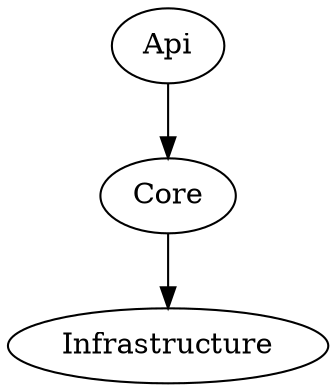

# Dependency graph (optional)

Goal: produce a simple dependency graph artifact (e.g. DOT/SVG) so engineers and PMs can see layering at a glance.

## Recommended approach

- Generate a **Graphviz DOT** file from project/assembly references.
- Convert DOT to SVG/PNG using Graphviz (`dot`).

## Minimal DOT format



## How to run (example)

1. Run the generator (in a small console app / repo-local tool / or a test that outputs artifacts):
   - output `artifacts/deps.dot`
2. Convert to SVG:

```bash
dot -Tsvg artifacts/deps.dot -o artifacts/deps.svg
```

3. Use in draw.io (diagrams.net) (optional):
   - Import the generated `artifacts/deps.svg`, then edit annotations as needed.

## Pack-provided tool (optional)

This pack can include a small console tool that scans `*.csproj` project references and emits `deps.dot` without external dependencies.

- Source: `tools/dependency-graph/`
- Output: `artifacts/deps.dot`

Notes:

- Keep this optional; it is for visibility, not a gate.
- The authoritative gate remains architecture tests (layering + firewalls).

## How to interpret (review checklist)

- **Horizontal dependencies**: check whether a Service references another Service's concrete implementation or internal adapters. Prefer ports (interfaces) and keep use-case ownership clear.
- **Cycles**: check for circular references (A -> B and B -> A, or longer cycles). Cycles increase refactor cost and test complexity.
- **Core as an island**: Core should not depend on Web/host or DB driver primitives. Dependency arrows should not point from Core to outer layers.

