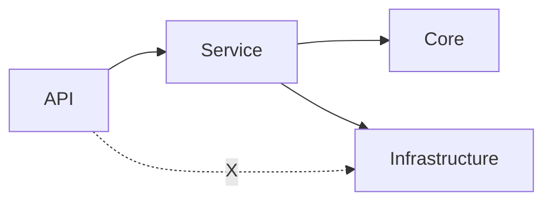

# Layered .NET Starter Pack

This folder is a **core part** of the portable starter pack used to bootstrap a layered .NET backend (architecture tests, firewall scans, Copilot guidance, and optional security/perf checklists). For full onboarding, start from the repository root `README.md` or an exported Seed folder rather than treating `docs/starter-pack/` as the only entrypoint.

## Goals

- **Copyable**: generic placeholders (`{Solution}`, `{CoreNamespace}`, …) and fictional cookbook names (`Project.*`, `Warehouse*`); no vendor-specific product branding in portable docs.
- **Modular**: start small, enable optional quality thresholds in phases.
- **Copilot-friendly**: rules + shadow examples are optimized to steer code generation.
- **CI-enforceable**: architecture rules are expressed as tests/analyzers where possible.

## Copy/replace checklist

After importing the Seed pack into your repo, or when working with this folder as part of that pack:

- Replace placeholders:
  - `{Solution}` (solution name)
  - `{CoreNamespace}` (e.g. `Acme.Core`)
  - `{InfrastructureNamespace}` (e.g. `Acme.Infrastructure`)
  - `{ApiNamespace}` (e.g. `Acme.Api`)
  - `{TestsNamespace}` (e.g. `Acme.Tests`)
- Decide which optional modules to enable first (see `optional/`).
- Prefer the shared AI-first setup flow from the root `README.md` and [`project-setup-protocol.md`](project-setup-protocol.md) when you want to rename the working directory into a real target project.

> [!IMPORTANT]
> Placeholder visibility and consistency
> - The actual pack files use **single braces** placeholders like `{Solution}`.
> - If you document placeholders as `{{Solution}}` for readability, ensure your team uses one consistent setup path so nobody mixes formats or misses replacements. The preferred route is the shared AI-first `Project Setup Protocol`.

## Layering at a glance

- **Dependency direction**: always outside-in (**API → Service → Core/Infrastructure**).
- **Forbidden path**: API must not bypass Service to touch Infrastructure.

## Layout

- `architecture-tests/`: Generic architecture test templates (`*.cs.txt`) you can copy into your test project.
- `shadow-examples/`: Copyable patterns (`*.cs.txt`) for services, repositories, mapping, result, controllers, and ASP.NET Core cross-cutting boundaries.
- `core/`: Core docs you can copy as-is (start here).
- `optional/`: Security/performance checklists you can adopt gradually.

When this pack is imported into a repository, treat `docs/ARCHITECTURE.md`, `docs/rules/**`, `templates/`, and `skeleton/` as the project source of truth. Treat `.cursor/rules/` and `.github/copilot-instructions.md` as IDE entrypoints/read-order indexes, and treat [`project-setup-protocol.md`](project-setup-protocol.md) as the shared setup contract.

For outbound starter patterns, look under `templates/` for:
- typed `HttpClient` adapters (`InventoryGateway`, `PricingGateway`, `ShipmentGateway`, `PaymentGateway`, `WebhookGateway`)
- broker-style post-commit publication (`MessagePublisher`)
- outbox-backed post-commit delivery (`OutboxRepository`, `OutboxDispatcher`, `OutboxDeliveryWorker`, and concrete delivery handlers)

> [!WARNING]
> Exception leak is a high-risk acceptance issue
> - DB driver exceptions (`System.Data.*`, `Microsoft.Data.SqlClient.*`) must not leak to API clients.
> - Treat `architecture-tests/ExceptionLeakTests.cs.txt` as a low-cost check threshold to prevent accidental sensitive output (connection strings, SQL fragments, schema names).

## What changes (expected outcomes)

This pack is designed to make cross-team delivery more consistent. It does not guarantee outcomes, but teams typically see improvements when they adopt the phases and keep the quality thresholds green:

- This pack is **not** a turnkey application. It provides copyable rules, templates, and executable quality thresholds you can integrate into an existing or new solution.

- **Fewer recurring defects**: layering violations, unsafe SQL patterns, sync-over-async pitfalls, and “business logic in the wrong layer”.
- **Easier acceptance**: more checks become executable (tests/scans), so acceptance relies less on subjective review.
- **Faster onboarding**: new engineers (and AI assistants) have a clear read order + copyable templates to follow.
- **Legacy-safe adoption**: the legacy track emphasizes explicit short-lived UoW rollout, avoiding long-lived request transactions, and avoiding aggressive refactors.

## Adoption phases

Choose **one** track depending on whether you are integrating into a legacy codebase or starting a new project.

### New project (step-by-step)

- **Phase A (day 0)**: Copy this tree + add `.cursor/rules/` and `.github/copilot-instructions.md` as supported AI entrypoints + use [`project-setup-protocol.md`](project-setup-protocol.md) for setup + enable analyzers. Also establish the audit-log baseline at the API entry point from day 0.
- **Phase B**: Add layering tests (`architecture-tests/GenericLayeringArchitectureTests.cs.txt`).
- **Phase C**: Add source-scan firewalls (repo/service/api).
- **Phase D**: Add security mapping (ASVS / ISO 27001), compliance-report templates, and performance acceptance templates to your delivery checklist.
- **Phase E**: Run the AI-assisted audit step and produce a reviewable compliance evidence bundle (`compliance-audit-report.md`, architecture-test logs/screenshots, and relevant `artifacts/`).

> Operational note: if developer machines or CI agents run Apex One or similar endpoint protection, the working directory, test output folders, and `artifacts/` may need a reviewed exclusion policy; reflection-heavy architecture tests and generated reports can otherwise become unexpectedly slow. See [`../rules/endpoint-protection.md`](../rules/endpoint-protection.md).

### Legacy project (modernize without breaking behavior)

- **Phase L0 (docs only)**: Introduce rules + examples as review guidance. No code changes required.
- **Phase L1 (low-noise checks)**: Add a minimal set of CI checks (layering + a few high-signal bans). Start with new/changed paths first.
- **Phase L2 (transaction cleanup first)**: remove request-wide transaction assumptions, keep remote IO out of active transactions, and move write paths toward explicit short-lived UoW.
  - **Nested transaction caution**: if legacy services open transactions manually (e.g. `TransactionScope`, `BeginTransaction`, manual `Commit/Rollback`), do not add a global transaction filter blindly.
    - Prefer to centralize the UoW in the use case first, or scope any automatic wrapper to narrow local-write endpoints only.
    - If you cannot clean it up yet, ensure the UoW is re-entrant/idempotent (e.g., depth-based begin; fail-fast rollback invalidates the unit of work).
- **Phase L3 (data access guardrails)**: Enforce repository SQL rules incrementally (new repos first, then older ones).
- **Phase L4 (optional roadmap)**: Add automation tracking (coverage/backlog) once the core guardrails are stable.
- **Phase E (after rollout)**: run the AI-assisted audit step to consolidate compliance evidence, residue checks, and human review notes.

## Notes

- Repo-local Markdown links **must** point to existing files (CI runs `scripts/ci/check-markdown-links.py`).
- External URLs are fine.
- If your team uses a generated working directory such as `_starter-pack-seed/out/`, treat it as a high-churn folder when discussing endpoint-protection exclusions with IT/security.
- The recommended Phase E report shape is a Markdown-table compliance matrix plus explicit evidence attachments; see [`../adr/0004-ai-assisted-audit-and-evidence-policy.md`](../adr/0004-ai-assisted-audit-and-evidence-policy.md).

## Core docs (start here)

- Transactions and UoW rules: [`core/transactions.md`](core/transactions.md)
- Legacy maintenance playbook for bugfix / small feature work: [`core/legacy-bugfix-feature-sop.md`](core/legacy-bugfix-feature-sop.md)
- New-project Day 0 collaboration checklist for mixed-tool teams: [`core/new-project-day0-collaboration-checklist.md`](core/new-project-day0-collaboration-checklist.md)
- Tool-neutral contribution workflow: [`../../CONTRIBUTING.md`](../../CONTRIBUTING.md)
- Raw requirement example: [`../requirements/raw/warehouse-onboarding-notes.md`](../requirements/raw/warehouse-onboarding-notes.md)
- Feature spec template: [`../specs/feature-spec-template.md`](../specs/feature-spec-template.md)
- Filled feature spec example: [`../specs/example-warehouse-create.md`](../specs/example-warehouse-create.md)
- PR template: [`../../.github/pull_request_template.md`](../../.github/pull_request_template.md)
- Bug issue template: [`../../.github/ISSUE_TEMPLATE/bug_report.md`](../../.github/ISSUE_TEMPLATE/bug_report.md)
- Feature issue template: [`../../.github/ISSUE_TEMPLATE/feature_request.md`](../../.github/ISSUE_TEMPLATE/feature_request.md)
- Incident hotfix issue template: [`../../.github/ISSUE_TEMPLATE/incident_hotfix.md`](../../.github/ISSUE_TEMPLATE/incident_hotfix.md)
- GitHub issue-template config: [`../../.github/ISSUE_TEMPLATE/config.yml`](../../.github/ISSUE_TEMPLATE/config.yml)
- Outbound timeout/retry/circuit-breaker rules: [`../rules/resilience.md`](../rules/resilience.md)
- Shared setup flow: [`project-setup-protocol.md`](project-setup-protocol.md)
- Audit logging baseline: [`../rules/audit-log.md`](../rules/audit-log.md)
- Request screening control: [`../rules/request-screening.md`](../rules/request-screening.md)
  - Opt-in only: inactive unless `RequestScreening:Enabled = true`; keep registration behind `AddRequestScreening(configuration)` so the feature is easy to remove later.
  - Use it as a `Probe` during maintenance, a `Safety Net` during refactoring, and a `Tourniquet` during incident response.
  - Treat it as a non-invasive, temporary control; long-lived fixes belong in the code path itself, and permanent rules belong in formal application mechanisms.
- Endpoint-protection guidance: [`../rules/endpoint-protection.md`](../rules/endpoint-protection.md)
- File upload & untrusted asset ingress (rules): [`../rules/file-upload.md`](../rules/file-upload.md)
- ADR habits (what/when/why): [`../adr/README.md`](../adr/README.md)
- AI-assisted audit policy: [`../adr/0004-ai-assisted-audit-and-evidence-policy.md`](../adr/0004-ai-assisted-audit-and-evidence-policy.md)
- Native ASP.NET Core application-boundary ADR: [`../adr/0005-native-aspnetcore-application-boundary-default.md`](../adr/0005-native-aspnetcore-application-boundary-default.md)

## Optional modules

- Logging (Serilog: Console / rolling file / Seq): [`optional/logging/serilog.md`](optional/logging/serilog.md)
- Minimal API local-write transaction wrapper templates: [`optional/minimal-api/transactions.md`](optional/minimal-api/transactions.md)
- Security / compliance audit report template: [`optional/security-compliance-audit-report-template.md`](optional/security-compliance-audit-report-template.md)
- Security / ISO 27001 control mapping template: [`optional/security-iso-27001-control-mapping-template.md`](optional/security-iso-27001-control-mapping-template.md)
- Security / OWASP ASVS template: [`optional/security-owasp-asvs-template.md`](optional/security-owasp-asvs-template.md)
- Security profile (Excel/OOXML upload): [`optional/security/excel-ooxml-upload.md`](optional/security/excel-ooxml-upload.md)
- Security profile (Image upload sanitization): [`optional/security/image-upload-sanitization.md`](optional/security/image-upload-sanitization.md)
- Dependency graph visualization: [`../optional/visualization/dependency-graph.md`](../optional/visualization/dependency-graph.md)
- Automation roadmap (lowest priority): [`../optional/automation/automation-coverage.md`](../optional/automation/automation-coverage.md)

