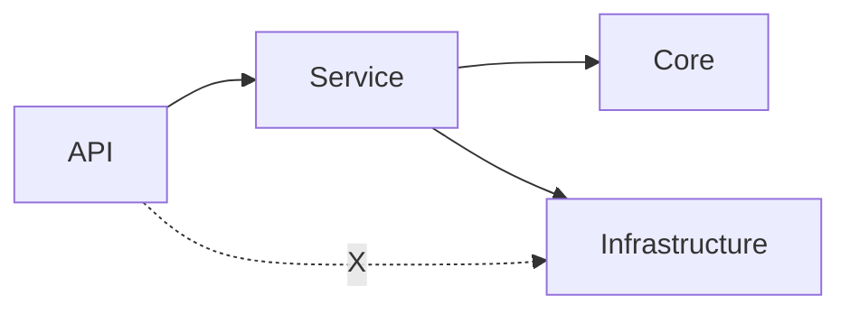

# Layered .NET Starter Pack

This folder is a **core part** of the portable starter pack used to bootstrap a layered .NET backend. It collects setup guidance, copyable patterns, architecture-test templates, and optional security/performance checklists.

For full onboarding, start from the repository root `README.md` or [`../START_HERE.md`](../START_HERE.md) rather than treating `docs/starter-pack/` as the only entrypoint.

## What This Pack Provides

- **Copyable structure**: portable placeholders (`{Solution}`, `{CoreNamespace}`, ...) and generic example names for reuse.
- **Layered defaults**: a clear API / service / core / infrastructure shape.
- **Executable guardrails**: architecture-test templates and rule documents that can be adopted gradually.
- **Optional modules**: additional security, performance, and platform-specific guidance when needed.

## Quick Use

Use this pack in three broad steps:

1. Start from [`../START_HERE.md`](../START_HERE.md) to choose the right path for the task.
2. Use [`project-setup-protocol.md`](project-setup-protocol.md) when the working directory must be renamed or aligned to a real project.
3. Use the `core/`, `architecture-tests/`, `shadow-examples/`, and `optional/` folders according to the stage and scope of the work.

> [!IMPORTANT]
> Placeholder visibility and consistency
> - The actual pack files use **single braces** placeholders like `{Solution}`.
> - If you document placeholders as `{{Solution}}` for readability, ensure your team uses one consistent setup path so nobody mixes formats or misses replacements.

## Layering at a glance

- **Dependency direction**: always outside-in (**API → Service → Core/Infrastructure**).
- **Forbidden path**: API must not bypass Service to touch Infrastructure.

## Layout

- `architecture-tests/`: Generic architecture test templates (`*.cs.txt`) you can copy into your test project.
- `shadow-examples/`: Copyable patterns (`*.cs.txt`) for services, repositories, mapping, result, controllers, and ASP.NET Core cross-cutting boundaries.
- `core/`: Core docs you can copy as-is (start here).
- `optional/`: Security/performance checklists you can adopt gradually.

When this pack is imported into a repository, treat `docs/ARCHITECTURE.md`, `docs/rules/**`, `templates/`, and `skeleton/` as the main engineering references. Use [`project-setup-protocol.md`](project-setup-protocol.md) for setup-related renaming and alignment work.

For outbound starter patterns, look under `templates/` for:
- typed `HttpClient` adapters (`InventoryGateway`, `PricingGateway`, `ShipmentGateway`, `PaymentGateway`, `WebhookGateway`)
- broker-style post-commit publication (`MessagePublisher`)
- outbox-backed post-commit delivery (`OutboxRepository`, `OutboxDispatcher`, `OutboxDeliveryWorker`, and concrete delivery handlers)

> [!WARNING]
> Exception leak is a high-risk acceptance issue
> - DB driver exceptions (`System.Data.*`, `Microsoft.Data.SqlClient.*`) must not leak to API clients.
> - Treat `architecture-tests/ExceptionLeakTests.cs.txt` as a low-cost check threshold to prevent accidental sensitive output (connection strings, SQL fragments, schema names).

## What Teams Usually Use First

Most teams start with a small subset:

- `core/` for the working style and day-to-day checklists
- `project-setup-protocol.md` for rename / namespace / path alignment
- `architecture-tests/` when they want executable boundary checks
- `shadow-examples/` and `templates/` when they need nearby copy patterns
- `optional/` only when the current project needs those extra modules

## Core docs (start here)

- Daily work quickstart for common task types: [`core/daily-work-quickstart.md`](core/daily-work-quickstart.md)
- Transactions and UoW rules: [`core/transactions.md`](core/transactions.md)
- Legacy maintenance playbook for bugfix / small feature work: [`core/legacy-bugfix-feature-sop.md`](core/legacy-bugfix-feature-sop.md)
- New-project Day 0 collaboration checklist for mixed-tool teams: [`core/new-project-day0-collaboration-checklist.md`](core/new-project-day0-collaboration-checklist.md)
- Tool-neutral contribution workflow: [`../../CONTRIBUTING.md`](../../CONTRIBUTING.md)
- Raw requirement example: [`../requirements/raw/warehouse-onboarding-notes.md`](../requirements/raw/warehouse-onboarding-notes.md)
- Feature spec template: [`../specs/feature-spec-template.md`](../specs/feature-spec-template.md)
- Filled feature spec example: [`../specs/example-warehouse-create.md`](../specs/example-warehouse-create.md)
- PR template: [`../../.github/pull_request_template.md`](../../.github/pull_request_template.md)
- Bug issue template: [`../../.github/ISSUE_TEMPLATE/bug_report.md`](../../.github/ISSUE_TEMPLATE/bug_report.md)
- Feature issue template: [`../../.github/ISSUE_TEMPLATE/feature_request.md`](../../.github/ISSUE_TEMPLATE/feature_request.md)
- Incident hotfix issue template: [`../../.github/ISSUE_TEMPLATE/incident_hotfix.md`](../../.github/ISSUE_TEMPLATE/incident_hotfix.md)
- GitHub issue-template config: [`../../.github/ISSUE_TEMPLATE/config.yml`](../../.github/ISSUE_TEMPLATE/config.yml)
- Outbound timeout/retry/circuit-breaker rules: [`../rules/resilience.md`](../rules/resilience.md)
- Shared setup flow: [`project-setup-protocol.md`](project-setup-protocol.md)
- Audit logging baseline: [`../rules/audit-log.md`](../rules/audit-log.md)
- Request screening control: [`../rules/request-screening.md`](../rules/request-screening.md)
- Endpoint-protection guidance: [`../rules/endpoint-protection.md`](../rules/endpoint-protection.md)
- File upload & untrusted asset ingress (rules): [`../rules/file-upload.md`](../rules/file-upload.md)
- ADR habits (what/when/why): [`../adr/README.md`](../adr/README.md)
- Audit policy: [`../adr/0004-ai-assisted-audit-and-evidence-policy.md`](../adr/0004-ai-assisted-audit-and-evidence-policy.md)
- Native ASP.NET Core application-boundary ADR: [`../adr/0005-native-aspnetcore-application-boundary-default.md`](../adr/0005-native-aspnetcore-application-boundary-default.md)

## Optional modules

- Logging (Serilog: Console / rolling file / Seq): [`optional/logging/serilog.md`](optional/logging/serilog.md)
- Minimal API local-write transaction wrapper templates: [`optional/minimal-api/transactions.md`](optional/minimal-api/transactions.md)
- Security / compliance audit report template: [`optional/security-compliance-audit-report-template.md`](optional/security-compliance-audit-report-template.md)
- Security / ISO 27001 control mapping template: [`optional/security-iso-27001-control-mapping-template.md`](optional/security-iso-27001-control-mapping-template.md)
- Security / OWASP ASVS template: [`optional/security-owasp-asvs-template.md`](optional/security-owasp-asvs-template.md)
- Security profile (Excel/OOXML upload): [`optional/security/excel-ooxml-upload.md`](optional/security/excel-ooxml-upload.md)
- Security profile (Image upload sanitization): [`optional/security/image-upload-sanitization.md`](optional/security/image-upload-sanitization.md)
- Dependency graph visualization: [`../optional/visualization/dependency-graph.md`](../optional/visualization/dependency-graph.md)
- Automation roadmap (lowest priority): [`../optional/automation/automation-coverage.md`](../optional/automation/automation-coverage.md)

