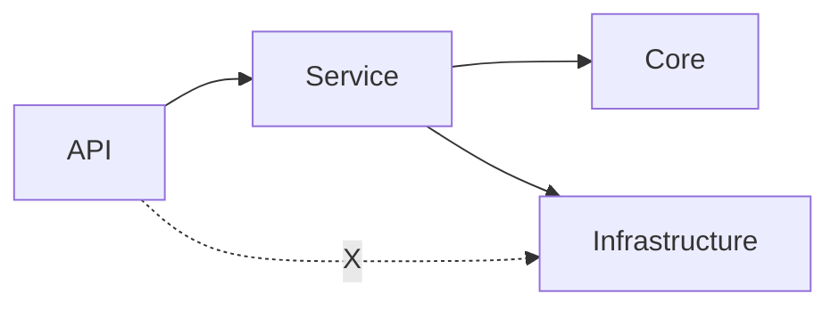

# Layered .NET Starter Pack

This folder is the **only** tree you should copy into a new repository to bootstrap a layered .NET backend (architecture tests, firewall scans, Copilot guidance, and optional security/perf checklists).

## Goals

- **Copyable**: generic placeholders (`{Solution}`, `{CoreNamespace}`, …) and fictional cookbook names (`Project.*`, `Warehouse*`); no vendor-specific product branding in portable docs.
- **Modular**: start small, enable optional quality thresholds in phases.
- **Copilot-friendly**: rules + shadow examples are optimized to steer code generation.
- **CI-enforceable**: architecture rules are expressed as tests/analyzers where possible.

## Copy/replace checklist

After copying `docs/starter-pack/` into your repo:

- Replace placeholders:
  - `{Solution}` (solution name)
  - `{CoreNamespace}` (e.g. `Acme.Core`)
  - `{InfrastructureNamespace}` (e.g. `Acme.Infrastructure`)
  - `{ApiNamespace}` (e.g. `Acme.Api`)
  - `{TestsNamespace}` (e.g. `Acme.Tests`)
- Decide which optional modules to enable first (see `optional/`).

> [!IMPORTANT]
> Placeholder visibility and consistency
> - The actual pack files use **single braces** placeholders like `{Solution}`.
> - If you document placeholders as `{{Solution}}` for readability, ensure your team uses a single **automated initializer script** (e.g. `initialize.ps1`) so nobody mixes formats or misses replacements.

## Layering at a glance

- **Dependency direction**: always outside-in (**API → Service → Core/Infrastructure**).
- **Forbidden path**: API must not bypass Service to touch Infrastructure.

## Layout

- `architecture-tests/`: Generic architecture test templates (`*.cs.txt`) you can copy into your test project.
- `shadow-examples/`: Copyable patterns (`*.cs.txt`) for services, repositories, mapping, result, controllers, and ASP.NET Core cross-cutting boundaries.
- `core/`: Core docs you can copy as-is (start here).
- `optional/`: Security/performance checklists you can adopt gradually.

> [!WARNING]
> Exception leak is a high-risk acceptance issue
> - DB driver exceptions (`System.Data.*`, `Microsoft.Data.SqlClient.*`) must not leak to API clients.
> - Treat `architecture-tests/ExceptionLeakTests.cs.txt` as a low-cost check threshold to prevent accidental sensitive output (connection strings, SQL fragments, schema names).

## What changes (expected outcomes)

This pack is designed to make cross-team delivery more consistent. It does not guarantee outcomes, but teams typically see improvements when they adopt the phases and keep the quality thresholds green:

- This pack is **not** a turnkey application. It provides copyable rules, templates, and executable quality thresholds you can integrate into an existing or new solution.

- **Fewer recurring defects**: layering violations, unsafe SQL patterns, sync-over-async pitfalls, and “business logic in the wrong layer”.
- **Easier acceptance**: more checks become executable (tests/scans), so acceptance relies less on subjective review.
- **Faster onboarding**: new engineers (and AI assistants) have a single read order + copyable templates to follow.
- **Legacy-safe adoption**: the legacy track emphasizes explicit short-lived UoW rollout, avoiding long-lived request transactions, and avoiding aggressive refactors.

## Adoption phases

Choose **one** track depending on whether you are integrating into a legacy codebase or starting a new project.

### New project (step-by-step)

- **Phase A (day 0)**: Copy this tree + add `.github/copilot-instructions.md` + enable analyzers.
- **Phase B**: Add layering tests (`architecture-tests/GenericLayeringArchitectureTests.cs.txt`).
- **Phase C**: Add source-scan firewalls (repo/service/api).
- **Phase D**: Add security mapping (ASVS) and performance acceptance templates to your delivery checklist.

### Legacy project (modernize without breaking behavior)

- **Phase L0 (docs only)**: Introduce rules + examples as review guidance. No code changes required.
- **Phase L1 (low-noise checks)**: Add a minimal set of CI checks (layering + a few high-signal bans). Start with new/changed paths first.
- **Phase L2 (transaction cleanup first)**: remove request-wide transaction assumptions, keep remote IO out of active transactions, and move write paths toward explicit short-lived UoW.
  - **Nested transaction caution**: if legacy services open transactions manually (e.g. `TransactionScope`, `BeginTransaction`, manual `Commit/Rollback`), do not add a global transaction filter blindly.
    - Prefer to centralize the UoW in the use case first, or scope any automatic wrapper to narrow local-write endpoints only.
    - If you cannot clean it up yet, ensure the UoW is re-entrant/idempotent (e.g., depth-based begin; fail-fast rollback invalidates the unit of work).
- **Phase L3 (data access guardrails)**: Enforce repository SQL rules incrementally (new repos first, then older ones).
- **Phase L4 (optional roadmap)**: Add automation tracking (coverage/backlog) once the core guardrails are stable.

## Notes

- Repo-local Markdown links **must** point to existing files (CI runs `scripts/ci/check-markdown-links.py`).
- External URLs are fine.

## Core docs (start here)

- Transactions and UoW rules: [`core/transactions.md`](core/transactions.md)
- Outbound timeout/retry/circuit-breaker rules: [`../rules/resilience.md`](../rules/resilience.md)
- File upload & untrusted asset ingress (rules): [`../rules/file-upload.md`](../rules/file-upload.md)
- ADR habits (what/when/why): [`../adr/README.md`](../adr/README.md)

## Optional modules

- Logging (Serilog: Console / rolling file / Seq): [`optional/logging/serilog.md`](optional/logging/serilog.md)
- Minimal API local-write transaction wrapper templates: [`optional/minimal-api/transactions.md`](optional/minimal-api/transactions.md)
- Security profile (Excel/OOXML upload): [`optional/security/excel-ooxml-upload.md`](optional/security/excel-ooxml-upload.md)
- Security profile (Image upload sanitization): [`optional/security/image-upload-sanitization.md`](optional/security/image-upload-sanitization.md)
- Dependency graph visualization: [`../optional/visualization/dependency-graph.md`](../optional/visualization/dependency-graph.md)
- Automation roadmap (lowest priority): [`../optional/automation/automation-coverage.md`](../optional/automation/automation-coverage.md)

